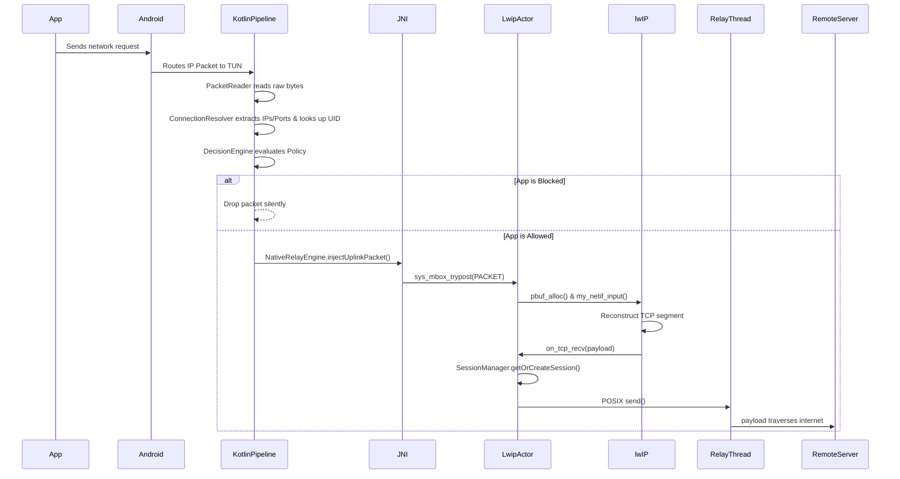
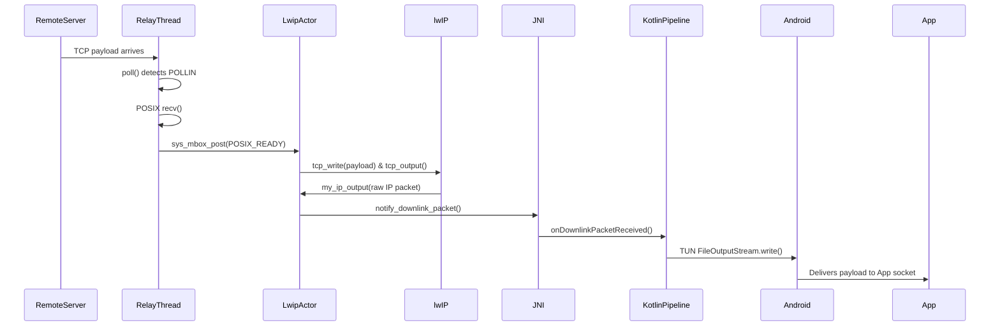

# Packet Pipeline

This document explains the step-by-step lifecycle of an IP packet as it travels from an originating application, through the firewall, out to the internet, and back.

## Uplink: Device to Internet

### 1. The Application Request
An allowed application (e.g., Chrome) attempts to open a TCP connection to `8.8.8.8:443`. It asks the OS for a socket and writes data.

### 2. TUN Interface Routing
Because `AccessManagerVpnService` is active and holds a `0.0.0.0/0` route, Android intercepts the packet at the kernel level and delivers the raw IPv4 packet into the VPN `ParcelFileDescriptor`.

### 3. Packet Reading & Resolution
The `PacketReader` (running in an IO coroutine) reads the byte array. It hands the bytes to the `ConnectionResolver`. The resolver parses the IPv4 and TCP headers to extract the Source IP, Source Port, Destination IP, and Destination Port. Using Android's `ConnectivityManager`, it queries the OS for the UID that owns this specific 4-tuple.

### 4. Policy Evaluation
The `DecisionEngine` checks if the UID is in the Blocklist. If blocked, the packet is discarded immediately. The application will experience a connection timeout. If allowed, the packet is passed down to the JNI bridge.

### 5. JNI Boundary
`injectUplinkPacket` copies the byte array and posts a pointer to it into a thread-safe mailbox (`sys_mbox_t`). This safely crosses the thread boundary into the C++ `LwipBackend` Actor thread.

### 6. lwIP Processing
The Actor thread wakes up, retrieves the packet from the mailbox, wraps it in a `pbuf` (lwIP's packet buffer structure), and injects it into the virtual network interface via `netif->input()`. lwIP processes the TCP state machine (handling SYNs, ACKs, Retransmissions).

### 7. POSIX Socket Translation
When lwIP successfully extracts the inner application payload, it fires `on_tcp_recv`. 
The `SessionManager` is invoked. If this is a new connection, `SessionManager` creates a real non-blocking POSIX socket (`socket(AF_INET, SOCK_STREAM)`), calls back into Kotlin via JNI to `protect()` the socket (preventing it from being routed back into the TUN), and calls `connect()`.
The payload is then written to the socket via `send()`.

---

## Downlink: Internet to Device

### 1. Payload Reception
The remote server responds. The data arrives at the physical network interface (Wi-Fi/Cellular). Android routes it to our `SessionManager`'s POSIX socket because it was `protect()`ed. `RelayThread`, which is spinning on `poll()`, wakes up, reads the payload using `recv()`, and places it in a buffer. It signals the Actor thread via mailbox.

### 2. lwIP Packetization
The Actor thread reads the payload buffer. It feeds the payload into lwIP via `tcp_write()`. lwIP wraps the payload in TCP and IPv4 headers, calculates checksums, and pushes it out via `my_ip_output()`.

### 3. JNI Delivery
The C++ layer converts the raw packet into a JNI `jbyteArray` and triggers the `onDownlinkPacketReceived` callback on the Kotlin side.

### 4. TUN Write
The Kotlin coroutine receives the packet and writes it into the `ParcelFileDescriptor`'s output stream. Android's kernel receives the raw packet, matches it to Chrome's socket, and delivers the payload natively.
