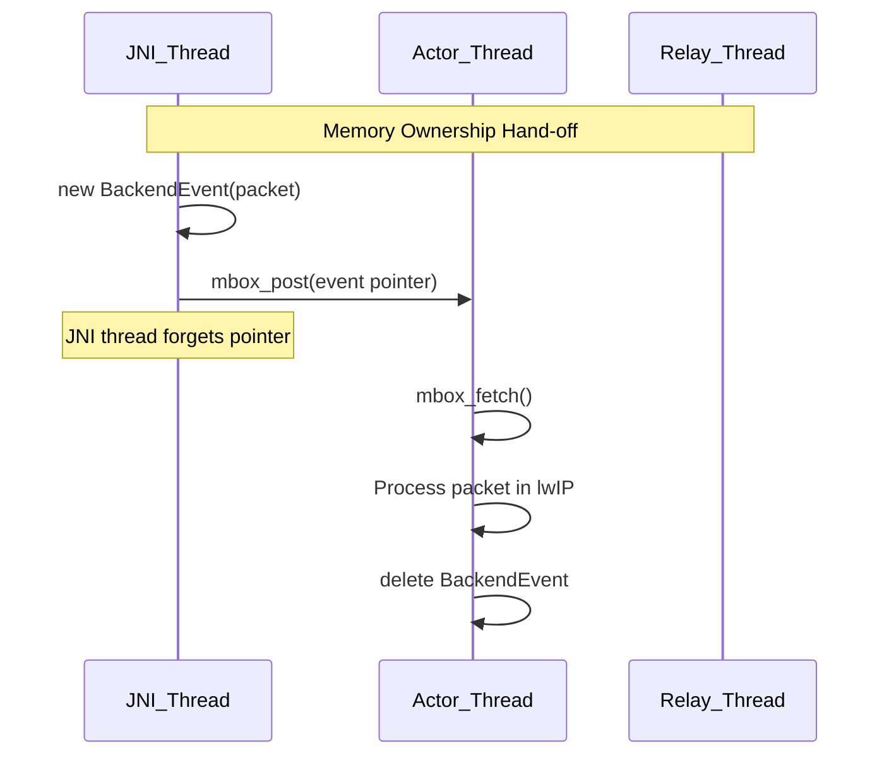

# Native Architecture

AccessManager's core networking engine operates entirely in C++ to achieve maximum throughput and memory efficiency. This document outlines the architectural components of the `libaccessmanager-core.so` shared library.

## Components

### 1. JNI (Java Native Interface)
The `bridge.cpp` file contains all `JNIEXPORT` functions. Its sole responsibility is to translate JVM parameters (`jbyteArray`, `jint`) into C++ primitives (`uint8_t*`, `size_t`). It owns a global reference to the Kotlin callbacks object (`g_callbacks_obj`) and dynamically attaches/detaches JVM threads when making asynchronous callbacks (e.g., `notify_downlink_packet`).

### 2. NativeBridge (Kotlin abstraction)
On the Kotlin side, `JniNativeBridge` provides a crash-safe wrapper around the raw C++ functions. It uses defensive `try/catch` blocks for all `UnsatisfiedLinkError` and `RuntimeException` cases to ensure the UI never crashes if the `.so` fails to load on an unsupported architecture.

### 3. RelayEngine
The overarching class encompassing `LwipBackend` and `RelayThread`. It initializes the lwIP memory pools and starts the worker threads.

### 4. Actor Thread (`worker_thread`)
To completely eliminate mutex locking overhead (which ruins network throughput), the `LwipBackend` runs as a pure **Actor**. 
- It is the **ONLY** thread allowed to call lwIP functions.
- It is the **ONLY** thread allowed to create or modify `Session` objects in the `SessionManager`.
- It blocks on `sys_arch_mbox_fetch`, waiting for events.
Events (like new packets from the TUN, or `POSIX_READY` signals from the `RelayThread`) are posted to its mailbox. It processes one event at a time sequentially.

### 5. RelayThread
A secondary thread entirely dedicated to monitoring POSIX sockets.
- It runs a tight `poll()` loop over all active internet sockets.
- When a socket becomes readable (`POLLIN`), it reads the payload and posts a `POSIX_READY` event to the Actor thread's mailbox.
- When a socket becomes writable (`POLLOUT`) after being choked (`EAGAIN`), it posts `POSIX_READY_OUT`.
- It communicates with the Actor Thread exclusively via mailboxes and a control pipe (`ctrl_pipe`) to wake up the `poll()` loop dynamically when new sockets are added.

### 6. SessionManager
Owns the lifecycle of the POSIX sockets. It maps a 4-tuple (`SessionKey`) to a `Session` struct. See [Session Management](05_SESSION_MANAGEMENT.md) for details.

### 7. AddressTranslator
A stateless utility class that parses raw IP headers, extracts the `SessionKey`, and safely performs NAT checksum differential updates without recalculating the entire packet checksum.

### 8. lwIP (Lightweight IP)
The open-source embedded TCP/IP stack. We use it strictly in RAW mode, without its OS-level socket abstractions, acting as a highly reliable state machine.

## Thread & Memory Ownership

| Component | Owned By | Thread Safety |
| :--- | :--- | :--- |
| `lwIP PCBs` | `LwipBackend` | Actor Thread Only |
| `Session Objects` | `SessionManager` | Actor Thread Only |
| `POSIX FDs` | `SessionManager` | Created by Actor, Polled by RelayThread |
| `pbuf` structures | `lwIP` | Actor Thread Only |
| `BackendEvent` | Heap | Created by JNI/RelayThread, Deleted by Actor |

