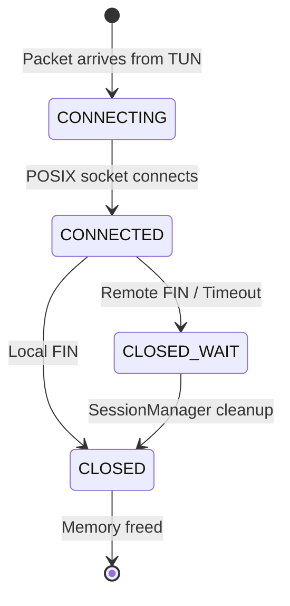

# Session Management

`SessionManager` bridges the gap between the virtual lwIP stack and the physical Android OS network. Every unique connection (TCP or UDP) from the TUN is tracked as a `Session`.

## Session Lifecycle

A `Session` is strictly identified by a `SessionKey` (Source IP, Source Port, Protocol, IP Version).

## TCP Lifecycle
1. **Initialization:** When `lwIP` receives a SYN packet, it triggers the `tcp_accept` callback. The Actor Thread asks `SessionManager` to create a `Session`.
2. **Socket Creation:** `SessionManager` creates a POSIX `socket()`, makes it non-blocking, and calls back to Kotlin to `protect()` it.
3. **Connection:** It calls `connect()` to the original destination. Since it is non-blocking, it usually returns `EINPROGRESS`.
4. **Data Transfer:** Payload from `lwIP` is written via `send()`. If `send()` returns `EAGAIN` (socket buffer full), the payload is queued in `session->tx_queue` (`pbuf` chain) and `RelayThread` adds a `POLLOUT` watch.
5. **Closure:** When `lwIP` receives a FIN from the app, it calls `tcp_recv` with a `NULL` buffer. `SessionManager` closes the POSIX socket and calls `tcp_close(pcb)`. If `tcp_close` fails due to memory pressure, it falls back to `tcp_abort(pcb)`.

## UDP Lifecycle
Unlike TCP, UDP is connectionless.
1. **Initialization:** The first UDP packet to a destination creates a `Session`.
2. **Pseudo-Connection:** `connect()` is still called on the UDP socket. This pins the socket to the remote destination, allowing us to use `send()` and `recv()` instead of `sendto()` and `recvfrom()`, and allows `poll()` to efficiently track the FD.
3. **Data Transfer:** Packets are forwarded immediately.

## Timeouts & Cleanup
- **TCP Keepalive:** All TCP sockets are configured with `SO_KEEPALIVE`. If the underlying network (e.g., Wi-Fi) disappears, the OS detects the dead peer and returns `ETIMEDOUT` to `poll()`. The `RelayThread` signals the Actor, which instantly destroys the session.
- **UDP Sweeping:** UDP sessions have no native teardown. The Actor thread runs `cleanupStaleSessions()` every 10 seconds. Any UDP session with no activity for `> 60,000ms` is destroyed and its socket closed.

## Resource Ownership
`SessionManager` has exclusive ownership of POSIX file descriptors (`fd`). When `closeSession()` is invoked, the `fd` is immediately passed to `::close(fd)`. No other thread is permitted to close sockets, preventing severe "double close" race conditions where file descriptors are re-used by the OS for unrelated connections.
