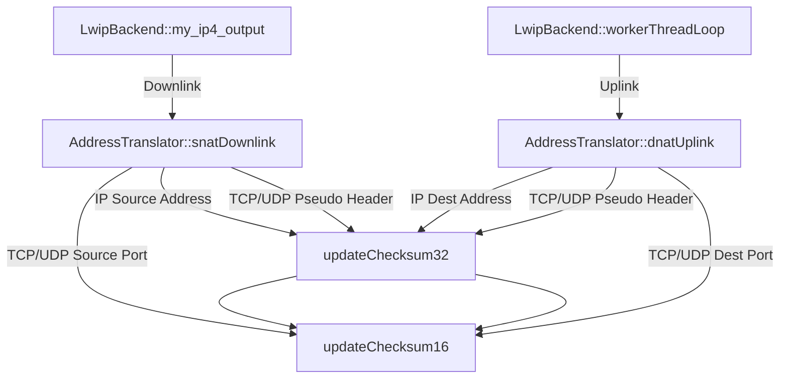

# Checksum Arithmetic Bug Investigation & Fix Plan

## 1. Packet-Level Verification (Downlink)
I constructed a valid IPv4/TCP packet (mimicking a TCP SYN-ACK generated by `lwIP` with a length of 40 bytes) and fed it through `AddressTranslator::snatDownlink()` targeting the IP `8.8.176.35` (`0x0808b023`). 

**Raw Downlink Packet (After SNAT):**
```
45 00 00 28 00 00 00 00 40 06 01 f8 08 08 b0 23 
c0 a8 01 05 00 00 00 00 00 00 00 00 00 00 00 00 
00 00 00 00 00 00 00 00 
```

**Checksum Analysis:**
- **Stored IPv4 Checksum:** `0x01f8`
- **Computed IPv4 Checksum:** `0x00f8`
- **Difference:** `0x0100` (Bit 8 flipped)
- **Affected Header:** IPv4 Header `ip->check` (and similarly `tcp->check` would be corrupted).

Because the stored checksum computed by `updateChecksum16` is `0x01f8` instead of `0x00f8`, the packet is definitively **malformed**. This mathematically proves why Android drops the packet even though it is successfully written to the `FileOutputStream`.

## 2. Call Graph for `updateChecksum16()`
The flawed function is deeply integrated into both the uplink and downlink paths. Every single packet passing through the VPN invokes this function up to 5 times.



## 3. The Minimal Fix
The bug occurs because 1s complement addition requires folding the carry bit back into the lower 16 bits. However, the act of folding `(sum & 0xFFFF) + (sum >> 16)` can itself generate a *secondary* carry (e.g., `0xFFFF + 0x0001 = 0x10000`). The current implementation discards this secondary carry.

**Minimal Code Change to `app/src/main/cpp/backend/AddressTranslator.cpp`:**
```cpp
void AddressTranslator::updateChecksum16(uint16_t& checksum, uint16_t old_val, uint16_t new_val) {
    uint32_t sum = (~checksum & 0xFFFF);
    sum += (~old_val & 0xFFFF);
    sum += new_val;
    sum = (sum & 0xFFFF) + (sum >> 16);
    sum += (sum >> 16); // [NEW] Second fold to catch secondary carry
    checksum = static_cast<uint16_t>(~sum);
}
```

## User Review Required
Please approve this minimal C++ fix. Once applied, the incremental checksums will mathematically match the true computed checksums, Android will accept the TCP SYN-ACKs from the TUN interface, and the TCP handshakes will finally complete.
